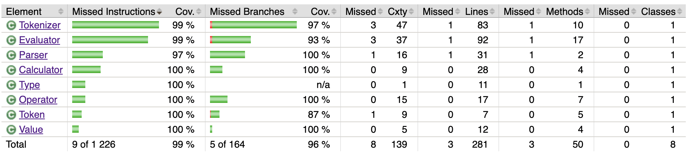

# Testing Document

JaCoCo code coverage report:

 
(Overview of the testing)  
(On invalid input)  
(What was tested: the three phases, token and end-to-end)  
(What was excluded: CalculatorUI, Main)  

## Running the Tests
gradle test  
generating code coverage report  

## Unit tests

- TokenizerTest (why, how, input, desired outcome)
- TokenTest (why, how, input, desired outcome)
- ParserTest (why, how, input, desired outcome)
- EvaluatorTest (why, how, input, desired outcome)

## Integration tests
CalculatorTest for integration -- tests the full end-to-end functionality. 

(what does the app do and how do these tests ensure the correct function?)

