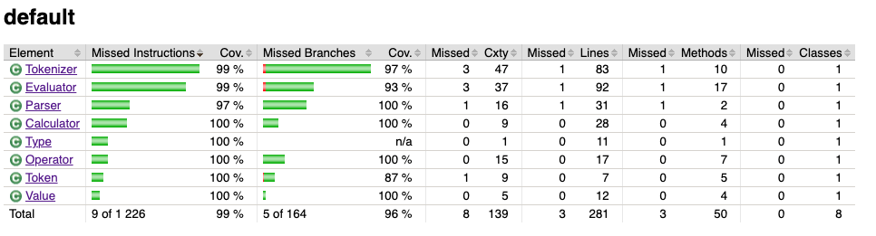

# Testing Document

JaCoCo code coverage report:

 
The project has been tested with unit tests and end-to-end tests. 
`Main` and `CalculatorUI` are intentionally excluded from the testing, 
as they are only used to provide the user interface.  

They key goal of this project is to create a calculator that:  
(1) correctly parses and evaluates all valid expressions containing the required operator types,  
and  
(2) recognises and specifically reports all the different types of 
errors that can be recognised using the chosen algorithm.  

The testing reflects these key goals in the extensive end-to-end testing in `CalculatorTest`.
Unit tests in `TokenizerTest`, `ParserTest`, `EvaluatorTest` and `TokenTest`
are provided to ensure the correct intermediary results.  

## Running the Tests
To run the tests and generate the jacoco report, run `gradle test`.  
The generated jacoco code coverage report can be found in `build/reports/jacoco`  

## End-to-end tests: CalculatorTest
The end-to-end tests in `CalculatorTest` are the core form of testing in this project. 

All types of operators are tested in various combinations and expression lengths, with both proper 
and poor formatting. Most of the expressions are the length one would expect 
to be used in a calculator, but also empty expressions, short expressions, and very long (256 tokens) expression
are included in the tests. For the valid expressions, the expression is fed to the calculator and 
compared to the correct result.

Making sure that invalid expressions are recognized is equally crucial. Calculator test makes 
sure the following errors are recognized with the appropriate error message:
- division by zero
- negative square root
- mismatched parenthesis
- uninitialized variable
- too many operands for the given operators
- too few operands for the given operators
- unrecognised characters are tested in the `TokenizerTest`

`Calculator` is also responsible for managing the variables, and therefore `CalculatorTest` 
also includes tests for variable assignment and use. Variable assignment can also arise 
errors, which are tested for:
- variable name can not be reserved function name
- variable name has to be of the required format
- variable assignment can only include one '='

## Unit tests
The Calculator parses and evaluates the expression in three phases: 
tokenizing, parsing, and evaluating. To ensure each of these stages 
work as intended, each of these stages is implemented in a separate 
class, and each has a corresponding set of unit tests.  

`TokenizerTest` for the first stage that splits the string into tokens. 
The test expressions are of varying length and contain all token types. 
Each test expression is tokenized, and the result comapred to the expected list 
of tokens. This also tests that an expression that cannot be evaluated 
is tokenized all the same. This set of tests also includes tests for 
all possible errors that can arise in the tokenizing stage: 
- unrecognised character
- unrecognised character inside a number
- unrecognised character inside a function name or variable name
- a number containing more than one decimal separator

`TokenTest`: The classes for tokens (Token, Value, Operator) are generally 
used as a vontainer for a token. The tokens contain very little of the program logic, 
this test set verifies the toString abd equals of tokens, and the priority of operator tokens.  

`ParserTest` for the second phase, ensures that tokens get correctly treated 
by the shunting yard algorithm. These tests are relatively light, as the 
correct parsing of the expression and the related errors are in the 
main focus of the end-to-end tests, and this stage takes in a list of tokens 
and outputs a list of tokens, which are both laborious to generate for no additional benefit.

`EvaluatorTest`, for the third and final phase, tests various types of expressions in reverse polish notation, 
and verifies correct result. Much like ParserTest, this test set is kept intentionally 
lean, as the intermediary data format is laborious and doesn't offer 
more value over the end-to-end tests.

